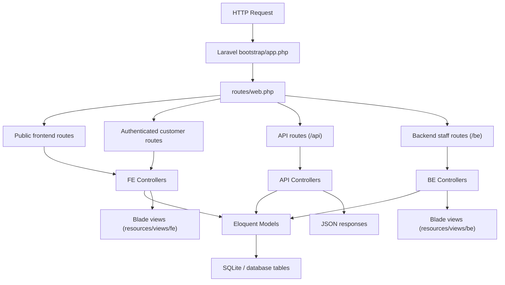
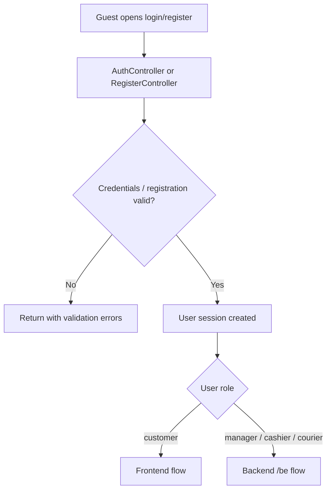
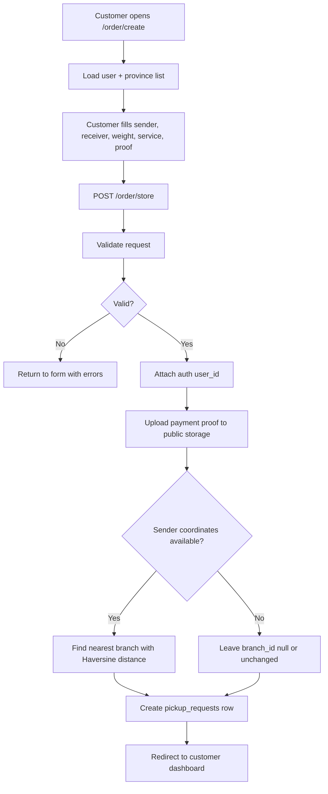
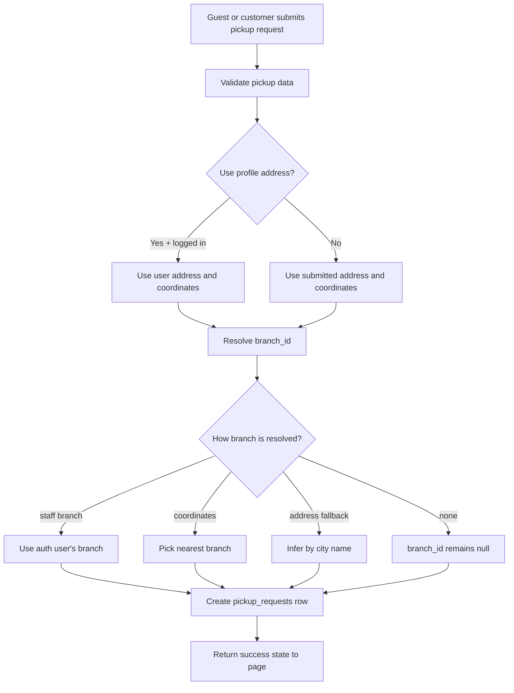
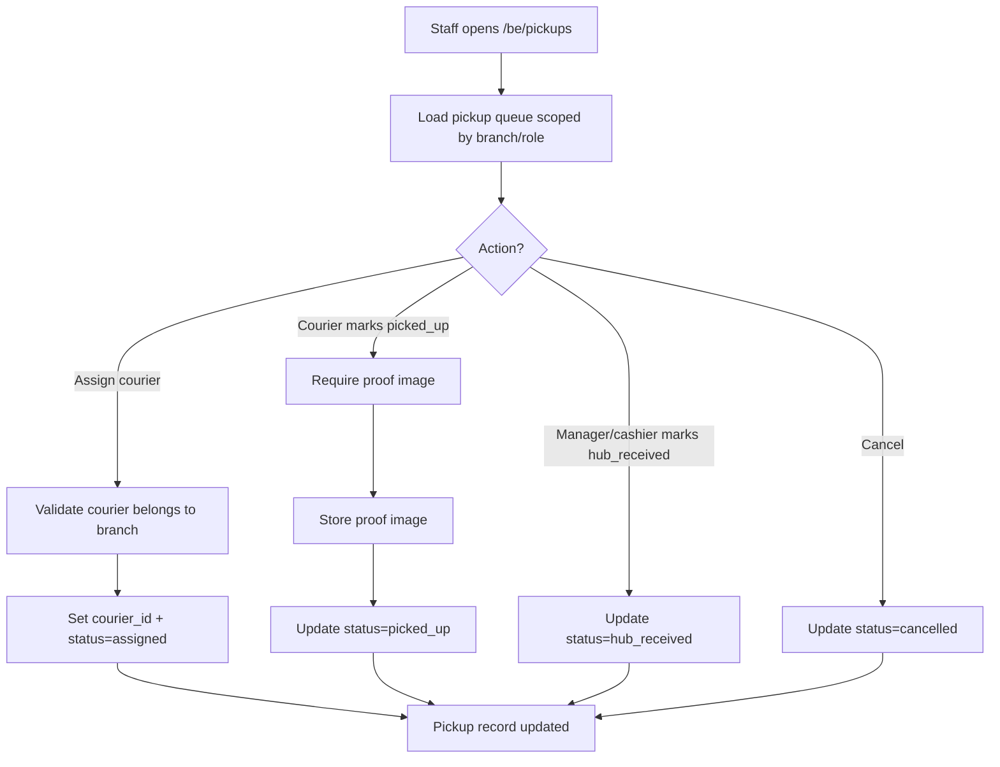
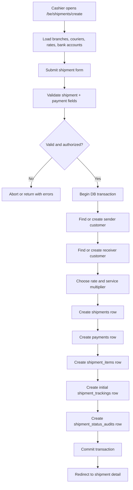
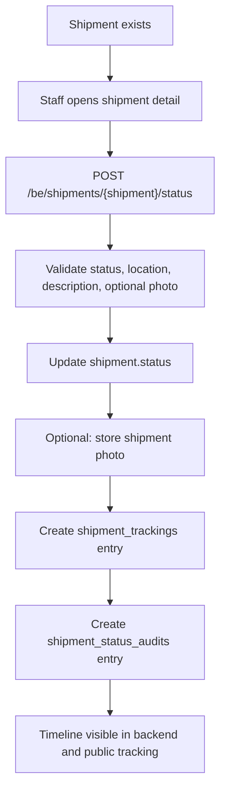
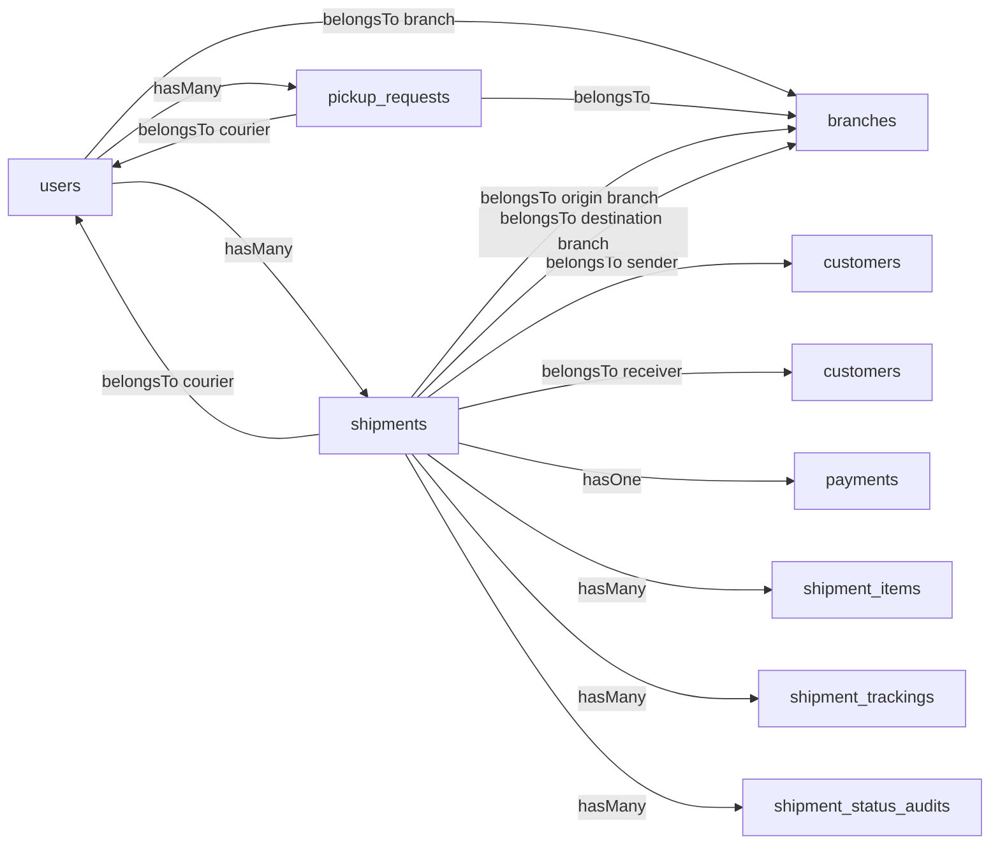

# Kilat Hitam Project Flow

## Overview

This project is a Laravel 13 logistics application with four main layers:

1. Public frontend for homepage, rate check, tracking, login, register, and public pickup requests.
2. Authenticated customer area for dashboard, profile, and shipment booking.
3. Public JSON API for cascading location dropdowns, rate calculation, and tracking lookup.
4. Staff backend under `/be` for operational processing by manager, cashier, and courier roles.

Core runtime flow:

- `bootstrap/app.php` registers the app, routes, and middleware aliases.
- `routes/web.php` is the main traffic controller for all web and API endpoints.
- Controllers orchestrate validation and business rules.
- Eloquent models persist logistics data such as `shipments`, `pickup_requests`, `payments`, and `shipment_trackings`.
- Blade views render both the frontend and backend interfaces.

## Main Actors

- Guest: can browse home, check rates, track shipments, submit pickup requests, login, and register.
- Customer: can access dashboard, update profile, and submit shipment booking requests.
- Cashier: can create shipments directly in backend and manage payment capture.
- Manager: can supervise branch shipments, pickups, staff, and reports.
- Courier: can receive pickup assignments and update shipment or pickup status.

## High-Level Request Flow

## Route Groups

### 1. Public Frontend

Main entry points:

- `/` -> `Fe\HomeController@index`
- `/track` -> `Fe\TrackingController@show`
- `/pickup-request` -> `Be\PickupController@store`
- `/login` and `/register`

Purpose:

- Show homepage.
- Perform embedded tracking lookup from query string.
- Perform embedded rate calculation from selected origin, destination, and weight.
- Allow public pickup requests even without login.

### 2. Customer Area

Protected by `auth` middleware:

- `/dashboard`
- `/profile`
- `/order/create`
- `/order/store`

Purpose:

- Show customer shipment and pickup history.
- Maintain customer profile and password.
- Submit customer-originated shipment booking requests.

### 3. API Layer

Public API endpoints:

- `/api/locations/provinsi`
- `/api/locations/kota`
- `/api/calculate-rate`
- `/api/public/track/{trackingNumber}`

Purpose:

- Feed frontend dropdowns.
- Compute shipping rates from zones and service type.
- Expose shipment timeline data in JSON.

### 4. Backend Staff Area

Protected by `auth` + `be.staff`, then narrowed by role-specific middleware:

- `shipment.hub` for shipment operations
- `pickup.hub` for pickup operations
- `personnel.manager` for staff management

Purpose:

- Operate shipment manifests.
- Assign couriers and update shipment status.
- Process pickup queue.
- View finance and reports.
- Manage branches and users.

## Authentication and Role Flow

## Customer Booking Flow

This is the flow for authenticated customers using `Fe\OrderController`.

Important note:

- Customer booking currently creates a `pickup_requests` record, not a `shipments` record.
- That means customer-submitted orders enter the pickup pipeline first and are later operationally handled by staff.

## Public Pickup Request Flow

This is handled by `Be\PickupController@store`, even though the route is public.

## Pickup Operations Flow

Handled in backend by `Be\PickupController`.

## Backend Shipment Creation Flow

This is the direct staff shipment flow handled by `Be\ShipmentController@store`.

## Shipment Tracking and Status Flow

Public tracking reads from the shipment timeline:

- `Fe\TrackingController@show` returns the tracking page.
- `Fe\TrackingController@apiShow` returns JSON timeline data.
- Both load `Shipment` with `originBranch`, `destinationBranch`, and ordered `trackings`.

## Core Data Relationships

## Practical Interpretation of the System

The project has two operational entry paths:

1. Customer/self-service path:
   Customer registers or logs in -> submits booking or pickup request -> record lands in `pickup_requests` -> branch staff and courier process it -> later the shipment lifecycle is handled operationally.

2. Counter/staff path:
   Cashier directly creates a shipment in backend -> payment is captured immediately -> tracking timeline starts at shipment creation -> manager/courier continue the status updates.

## Main Design Observation

The most important architectural detail is that the system is split into two related but separate pipelines:

- `pickup_requests` for intake, assignment, and doorstep collection.
- `shipments` for branch-level logistics, payment records, tracking timeline, and delivery status.

That separation is a solid operational idea, but it also means there is a handoff point between pickup intake and shipment creation. If you want, the next useful step would be to map exactly where a `pickup_request` is converted into a `shipment`, because that bridge does not appear to be automated in the currently inspected controllers.
